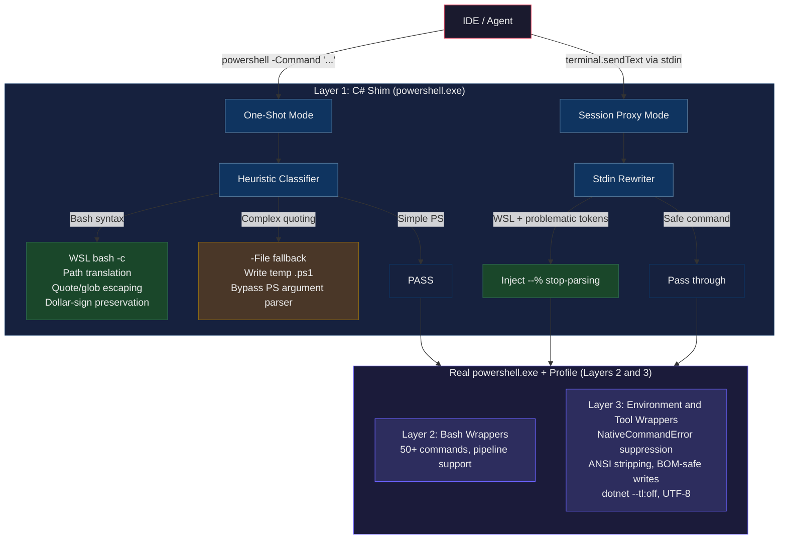

# shellfix

[](https://github.com/Akotz89/shellfix/actions/workflows/ci.yml)
[](LICENSE)
[](https://dotnet.microsoft.com/download/dotnet/8.0)
[](https://github.com/Akotz89/shellfix)

**Make Windows PowerShell stop breaking your AI agent commands.**

A three-layer defense system that lets AI coding agents (and humans) run commands transparently from Windows PowerShell terminals. Fixes bash quoting nightmares, path translation failures, `$` expansion, and the infamous red `NativeCommandError` text that makes agents think `git push` failed.

### Quick Start

```powershell
git clone https://github.com/Akotz89/shellfix.git
cd shellfix
.\install.ps1    # builds, installs, patches your IDE shortcuts
.\test.ps1       # verify everything works
# Restart your IDE → done
```

> **Pre-built binary?** Download from [Releases](https://github.com/Akotz89/shellfix/releases), then run `.\install.ps1 -SkipBuild`

---

## The Problem

AI coding agents (Cursor, Windsurf, GitHub Copilot, Antigravity, etc.) run commands through PowerShell on Windows. Three classes of failures occur constantly:

### Class 1: Bash commands mangled by PowerShell
```bash
grep -c "def " "C:\Users\Me\My Project\app.py"   # path breaks
awk '{print $1, $3}' data.txt                      # $1 eaten
find /project -name "*.py"                         # glob expanded
for i in 1 2 3; do echo "$i"; done                 # PS parse error
```

### Class 2: Complex quoting breaks native commands
```powershell
gh release create v1.0.0 --notes "here's the notes with `backticks`"  # parse error
dotnet build --property:Version="1.0.0-beta.1"                        # mangled
npm run build -- --config '{"minify":true}'                            # stripped
```

### Class 3: Stderr treated as error (red text)
```
git push origin main         # writes progress to stderr → red text
npm install                  # writes warnings to stderr → red text
dotnet build                 # writes diagnostics to stderr → red text
```

Agents see red text, think the command failed, and spiral into desperate workarounds — writing Python subprocess scripts, retrying with different escaping, or giving up entirely.

**shellfix fixes all three classes.**

## What Gets Fixed

| Command | Before | After |
|---|---|---|
| `grep "it's" file` | ❌ **Hangs forever** (unmatched quote) | ✅ Works |
| `awk '{print $1, $3}'` | ❌ `$1`/`$3` expanded to empty | ✅ Works |
| `find "path spaces" -name "*.py"` | ❌ Path split + glob expanded | ✅ Works |
| `for i in 1 2 3; do echo "$i"; done` | ❌ PS parse error | ✅ Works |
| `echo "a" && echo "b"` | ❌ PS 5.1 error | ✅ Works |
| `curl https://example.com` | ❌ Runs `Invoke-WebRequest` | ✅ Runs real curl |
| `C:\Users\Me\My Project\file.py` | ❌ Path not found | ✅ Auto-translated |
| `gh release create --notes "..."` | ❌ Quoting breaks PS parser | ✅ -File fallback |
| `git push origin main` | ❌ Red stderr text | ✅ Clean output |
| `npm install` | ❌ Warnings shown as errors | ✅ Clean output |
| `dotnet build` | ❌ Garbled Terminal Logger output | ✅ Auto `--tl:off` |
| Any command output | ❌ ANSI codes: `[31m` garble | ✅ Stripped clean |
| `Format-Table` output | ❌ Truncated with `...` | ✅ Full width |
| `Set-Content "file"` | ❌ UTF-16LE / BOM corruption | ✅ UTF-8 no-BOM |
| Deep `node_modules` paths | ❌ 260-char MAX_PATH failure | ✅ LongPathsEnabled |

## Architecture



### Layer 1: Compiled C# Shim

A .NET 8 executable named `powershell.exe` configured as the IDE's terminal shell. It operates in two modes:

**One-Shot Mode** (`powershell -Command "..."`): The shim classifies the command:
1. **Bash syntax** → escapes quotes, translates paths, routes to `wsl.exe -- bash -c`
2. **Complex PS quoting** → writes to a temp `.ps1` file, runs with `-File` (bypasses parser)
3. **Simple PS** → passes through to real `powershell.exe`
4. **Falls back** to real PowerShell if WSL crashes

**Session Proxy Mode** (interactive terminal / `terminal.sendText`): The shim spawns real `powershell.exe` as a child process and proxies stdin line-by-line. Each line is inspected:
1. If it starts with `wsl`/`wsl.exe` and contains problematic tokens (`&&`, `||`, `[N:-N]`, nested bash quotes) → rewrites with `--%` stop-parsing token
2. Otherwise → passes through unchanged

### Layer 2: PowerShell Profile — Bash Wrappers

Creates function wrappers for 50+ bash commands that handle path translation, quoting, dollar-sign escaping, and pipeline support.

### Layer 3: PowerShell Profile — Environment & Native Tool Wrappers

Wraps `git`, `npm`, `npx`, `dotnet`, `gh`, `cargo`, `rustc`, `docker`, and `kubectl` in functions that:

- Merge stderr to stdout as plain strings (prevents NativeCommandError red text)
- Strip ANSI escape codes from output (prevents `[31m` garbled text)
- Inject `--tl:off` for dotnet build/test/run/publish (disables Terminal Logger)
- Set `NO_COLOR=1` and `TERM=dumb` environment variables
- Set `$FormatEnumerationLimit = -1` to prevent output truncation
- Default `Set-Content`, `Out-File`, `Add-Content` to UTF-8 (prevents UTF-16LE/BOM corruption)
- Provide `Write-Utf8NoBom` helper for truly BOM-free file writes
- Guard against VS Code shell integration prompt conflicts
- Preserve real exit codes via `$LASTEXITCODE`

## Requirements

- Windows 10/11 with WSL2
- A WSL distribution (default: Ubuntu-24.04, configurable)
- .NET 8 SDK (for building from source) — or use a [pre-built release](https://github.com/Akotz89/shellfix/releases)
- PowerShell 5.1+ (comes with Windows)

## Installation

### Quick Install

```powershell
git clone https://github.com/Akotz89/shellfix.git
cd shellfix
.\install.ps1
```

### Pre-built Binary

Download from [Releases](https://github.com/Akotz89/shellfix/releases), then:

```powershell
.\install.ps1 -SkipBuild
```

### Verify

```powershell
.\test.ps1
```

## Configuration

### WSL Distribution

```powershell
.\install.ps1 -WslDistro "Ubuntu-22.04"
```

### Controls

| Control | How |
|---|---|
| **Disable shim** | `$env:PWSH_SHIM_BYPASS = "1"` |
| **Debug mode** | `$env:PWSH_SHIM_DEBUG = "1"` |
| **Uninstall** | `.\install.ps1 -Uninstall` |

## How It Works

### The Four-Layer Quoting Problem

When an IDE runs `powershell -Command "..."`, the string passes through four interpretation layers:

1. **IDE process spawner** → strips outer quotes
2. **Windows CreateProcess** → strips/mangles inner quotes  
3. **PowerShell parser** → interprets `$`, backticks, `&&`, single quotes
4. **Target shell (bash/cmd)** → interprets remaining special chars

Each layer has different escaping rules. A single `'` in "it's" becomes an unmatched quote in bash (hang). A `$1` in awk becomes empty (PS expansion). Progress text on stderr becomes red error text (PS 5.1 bug).

### How shellfix Solves Each Layer

| Layer | Problem | Fix |
|---|---|---|
| 2 | CreateProcess mangles quotes | `.NET ArgumentList` bypasses string quoting |
| 3 | PS expands `$`, chokes on `&&` | Shim intercepts before PS sees it |
| 3 | PS chokes on complex quoting | `-File` fallback writes to temp `.ps1` |
| 3 | PS treats stderr as error | Profile wraps native tools with `2>&1` conversion |
| 4 | Bash gets unescaped `'` and `$` | Shim escapes `'` → `\'` and `$` → `\$` |

### Path Translation

```
C:\Users\Me\My Project\file.py
  → '/mnt/c/Users/Me/My Project/file.py'

C:\Users\Me\code\app.py
  → /mnt/c/Users/Me/code/app.py
```

## Testing

```powershell
.\test.ps1           # Layer 2+3 tests (44 tests)
.\test-proxy.ps1     # Session proxy tests (16 tests)
.\test-replay.ps1    # Historical session replay (9 tests)
```

- `test.ps1` covers all failure classes (bash routing, quoting, NativeCommandError) plus Tier 1/2 features
- `test-proxy.ps1` covers the session proxy mode: `&&`, `[N:-N]`, nested quotes, and pure PS regression
- `test-replay.ps1` replays actual historical failures from real agent sessions (heredocs, python slices, curl pipes)

## FAQ

**Q: Does this work with Cursor / Windsurf / Copilot / Antigravity?**  
A: Yes. Both one-shot (`-Command`) and interactive (stdin) invocations are handled. Configure the IDE's terminal profile to point to the shim binary.

**Q: Will this break my normal PowerShell?**  
A: No. Kill switch: `$env:PWSH_SHIM_BYPASS = "1"`. Pure PS commands pass through unchanged.

**Q: Why do I still see red text sometimes?**  
A: Only tools in the wrapper list (`git`, `npm`, `gh`, etc.) are protected. If you find another tool that triggers NativeCommandError, add it to the `$nativeTools` array in the profile.

**Q: What about PowerShell 7?**  
A: PS 7 fixes `&&`/`||` and NativeCommandError natively. The shim and bash wrappers still provide value for path translation and bash routing.

**Q: Why not just switch to bash/Git Bash?**  
A: Many IDE agent frameworks default to PowerShell on Windows. The shim lets them work without reconfiguring the agent itself.

## Known Interactions

### Embedding Python/Ruby/Perl in bash scripts (Issue #4)

AI agents frequently write bash scripts as workarounds for quoting issues. When these scripts contain inline Python with f-strings, backslash escaping can get mangled by the IDE's file-writing tool.

**Problem:** `write_to_file` may double-escape `\"` inside f-strings:
```python
# What the agent writes:
print(f"\n=== Score: {summary.get(\"score\",0)}% ===\n")
# What appears in the file:
print(f"\\n=== Score: {summary.get(\\\"score\\\",0)}% ===\\n")
```

**Solution:** Use single-quoted heredocs to embed Python in bash scripts:
```bash
#!/bin/bash
python3 - "$@" << 'PYEOF'
import json, sys
data = json.load(sys.stdin)
print(f"\nScore: {data.get('score', 0)}%\n")
PYEOF
```

Single-quoted heredoc markers (`<< 'PYEOF'`) pass content verbatim — no escaping layer applies.

### Session Proxy (v1.5.0+)

Since v1.5.0, the shim intercepts **both** one-shot (`-Command`) and interactive (stdin) invocations. When configured as the IDE's terminal shell, it spawns real `powershell.exe` as a child and proxies every stdin line through `RewriteForProxy()`. This means `&&`, `[1:-1]`, and nested quotes in WSL commands are fixed transparently — even when the IDE sends them via `terminal.sendText()` into a persistent session.

For this to work, the IDE must be configured to launch the shim binary as its terminal profile (not the system `powershell.exe`).

### Agent `run_command` Interception (v1.5.2+)

VS Code-based IDEs' agent `run_command` tool bypasses all terminal settings — it spawns bare `powershell` directly from the Go language server binary. The shim is only found if the shim directory comes before `C:\Windows\System32\WindowsPowerShell\v1.0\` in PATH.

**Automatic setup** — the installer handles this:
```powershell
.\install.ps1
# Detects VS Code, Cursor, Windsurf, Antigravity IDE
# Patches shortcuts to prepend shellfix to PATH
# Creates .shellfix-backup files for easy uninstall
```

**Manual setup** — if you prefer:

1. Right-click the IDE shortcut → **Properties**
2. Change **Target** to:
   ```
   C:\Windows\System32\cmd.exe /C set "PATH=C:\Users\<user>\bin;%PATH%" && start "" "C:\path\to\IDE.exe"
   ```
3. Set **Run** to **Minimized** (hides the brief cmd flash)

Or use the generic `launch-ide.bat`:
```powershell
# Place launch-ide.bat in the same directory as the shim
launch-ide.bat "C:\path\to\IDE.exe" --your-args-here
```

**How it works:** The IDE process tree inherits the modified PATH. When the language server calls bare `powershell`, Go's `exec.LookPath` finds the shim first. This has zero system-wide blast radius — only IDE child processes are affected.

**Supported IDEs:**
- Visual Studio Code / VS Code Insiders
- Cursor
- Windsurf
- Antigravity IDE
- Any VS Code-based IDE (manual shortcut patch)

**Verify it's working:** Run this from the agent:
```powershell
(Get-CimInstance Win32_Process -Filter "ProcessId=$PID").CommandLine
# Should contain: shellfix_*.ps1 (shim's temp file pattern)
```

**Uninstall:** `.\install.ps1 -Uninstall` restores all shortcuts from backups.


## Contributing

See [CONTRIBUTING.md](CONTRIBUTING.md).

## License

[MIT](LICENSE)
