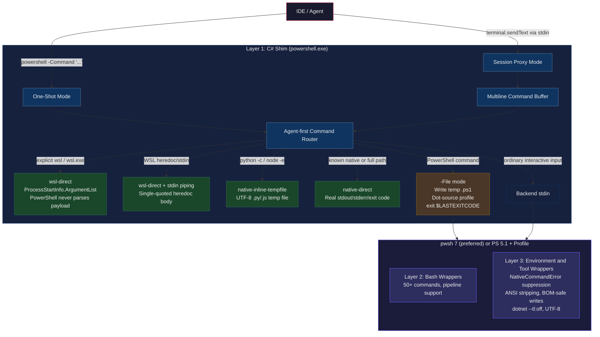

<p align="center">
  
</p>

[](https://github.com/Akotz89/shellfix/actions/workflows/ci.yml)
[](LICENSE)
[](https://dotnet.microsoft.com/download/dotnet/8.0)
[](https://github.com/Akotz89/shellfix)

**Reliable PowerShell and WSL command routing for AI coding agents.**

Shellfix is a Windows command shim for AI coding agents and terminal-heavy developer workflows. It reduces PowerShell quoting, WSL routing, path translation, stderr, ANSI, and UTF-8 friction so commands behave closer to what the caller intended.

### Quick Start

```powershell
git clone https://github.com/Akotz89/shellfix.git
cd shellfix
.\install.ps1    # compatibility bootstrapper; builds shellfix.exe and installs
shellfix doctor  # verifies install state, PATH, WSL, shortcuts, and IDE settings
.\test.ps1       # verifies shim behavior
# Restart your IDE after install
```

> **Pre-built binary?** Download `shellfix.exe`, `powershell.exe`, `install.ps1`, `Microsoft.PowerShell_profile.ps1`, `launch-ide.bat`, and `checksums.txt` from [Releases](https://github.com/Akotz89/shellfix/releases). Place them in one folder, then run `.\install.ps1 -SkipBuild`.
>
> **Verify checksums:** `Get-FileHash powershell.exe -Algorithm SHA256` — compare with `checksums.txt` in the release.
>
> **Uninstall:** `shellfix uninstall` restores recorded profile, shortcut, settings, and PATH state. `.\install.ps1 -Uninstall` remains as a compatibility wrapper.

---

## The Problem

AI coding agents and terminal-heavy Windows workflows often run commands through PowerShell. Three classes of failures show up repeatedly:

### Class 1: Bash commands mangled by PowerShell
```bash
grep -c "def " "C:\Users\Me\My Project\app.py"   # path breaks
awk '{print $1, $3}' data.txt                      # $1 eaten
find /project -name "*.py"                         # glob expanded
for i in 1 2 3; do echo "$i"; done                 # PS parse error
```

### Class 2: Complex quoting breaks native commands
```powershell
gh release create v1.0.0 --notes "here's the notes with `backticks`"  # parse error
dotnet build --property:Version="1.0.0-beta.1"                        # mangled
npm run build -- --config '{"minify":true}'                            # stripped
```

### Class 3: Stderr treated as failure output
```
git push origin main         # writes progress to stderr
npm install                  # writes warnings to stderr
dotnet build                 # writes diagnostics to stderr
```

Agents and automation can misread normal diagnostic streams as failures and retry with unnecessary quoting or subprocess workarounds.

**shellfix fixes all three classes.**

## What Gets Fixed

| Command | Without Shellfix | With Shellfix |
|---|---|---|
| `grep "it's" file` | Unmatched quote in bash | Routed with quote escaping |
| `awk '{print $1, $3}'` | `$1`/`$3` expanded by PowerShell | Dollar signs preserved |
| `find "path spaces" -name "*.py"` | Path split or glob expanded early | Path translated and glob protected |
| `for i in 1 2 3; do echo "$i"; done` | PowerShell parser error | Routed through WSL bash |
| `echo "a" && echo "b"` | PowerShell 5.1 parser error | Runs through a compatible backend path |
| `curl https://example.com` | May resolve to `Invoke-WebRequest` | Uses the native executable path |
| `C:\Users\Me\My Project\file.py` | Windows path not valid in WSL | Auto-translated to `/mnt/c/...` |
| `gh release create --notes "..."` | Quoting can break `-Command` parsing | Runs through temp-file `-File` mode |
| `git push origin main` | Progress stream appears as error text | Native tool wrapper normalizes output |
| `npm install` | Warnings can look like command failures | Native tool wrapper normalizes output |
| `dotnet build` | Terminal Logger output is hard to parse | Auto-injects `--tl:off` |
| Any command output | ANSI escape codes can leak into logs | ANSI output is stripped in wrappers |
| `Format-Table` output | Collections can truncate with `...` | Expanded formatting defaults |
| `Set-Content "file"` | UTF-16LE / BOM surprises | UTF-8 defaults |
| Deep `node_modules` paths | 260-character path limits | Long path support check |

## Architecture



### Layer 1: Compiled C# Shim

A .NET 8 executable named `powershell.exe` configured as the IDE's terminal shell. It prefers **PowerShell 7** (`pwsh.exe`) as its backend when available, falling back to PS 5.1 automatically. It operates in two modes:

**One-Shot Mode** (`powershell -Command "..."`): The shim classifies the command:
1. **Explicit WSL** -> runs `wsl` / `wsl.exe` directly with structured arguments so PowerShell never parses bash, Python, JSON, heredoc, or `$PATH` payloads
2. **WSL heredoc/stdin** -> unwraps supported heredoc wrappers and pipes the body to WSL stdin
3. **Native inline tools** -> runs `python -c`, `python3 -c`, `py -c`, and `node -e` through temporary script files so PowerShell never parses the code body
4. **Known native tools** -> runs resolved Windows tools directly when Shellfix can classify them safely
5. **PowerShell** -> writes to a temp `.ps1` file with profile dot-source and `exit $LASTEXITCODE`, runs with `-File`

PowerShell commands go through `-File` mode instead of `-Command`. This eliminates the command-line quote interpretation layer for PowerShell payloads while preserving normal PowerShell semantics for commands Shellfix cannot confidently route elsewhere.

**Session Proxy Mode** (interactive terminal / `terminal.sendText`): The shim spawns the PowerShell backend as a child process and proxies stdin line-by-line. Each line is inspected:
1. Multiline `python -c` / `node -e` payloads are buffered and executed natively through temporary script files
2. Explicit `wsl` / `wsl.exe` commands are routed directly through `wsl.exe` so PowerShell does not parse bash, Python, JSON, heredoc, or `$PATH` payloads
3. WSL heredoc stdin commands such as `wsl ... -- python3 << 'PY' ... PY` are buffered, unwrapped, and piped to WSL stdin
4. Known native tools and full-path native calls are executed directly when Shellfix can classify them safely
5. Otherwise -> passes through to the PowerShell backend

### Layer 2: PowerShell Profile — Bash Wrappers

Creates function wrappers for 50+ bash commands that handle path translation, quoting, dollar-sign escaping, and pipeline support.

### Layer 3: PowerShell Profile — Environment & Native Tool Wrappers

When the shellfix profile is loaded, wraps `git`, `npm`, `npx`, `dotnet`, `gh`, `cargo`, `rustc`, `docker`, `kubectl`, and `d2` in functions that:

- Merge stderr to stdout as plain strings (prevents NativeCommandError formatting)
- Strip ANSI escape codes from output (prevents raw control-code output)
- Inject `--tl:off` for dotnet build/test/run/publish (disables Terminal Logger)
- Set `NO_COLOR=1` and `TERM=dumb` environment variables
- Refresh PATH from persisted User/Machine environment entries so tools installed while an IDE is open are visible in new agent shells
- Set `$FormatEnumerationLimit = -1` to prevent output truncation
- Default `Set-Content`, `Out-File`, `Add-Content` to UTF-8 (prevents UTF-16LE/BOM corruption)
- Provide `Write-Utf8NoBom` helper for truly BOM-free file writes
- Guard against VS Code shell integration prompt conflicts
- Preserve real exit codes via `$LASTEXITCODE`

### Management CLI

`shellfix.exe` is the primary management surface. It installs the shim, records reversible state, repairs IDE settings, and reports diagnostics.

```powershell
shellfix install --wsl-distro Ubuntu-24.04
shellfix status --json
shellfix doctor
shellfix repair antigravity
shellfix test
shellfix uninstall
```

The default install root is `%LOCALAPPDATA%\Programs\Shellfix\`. For this release, the compatibility shim is also copied to `%USERPROFILE%\bin\powershell.exe` so existing IDE PATH interception keeps working. Install state is recorded in `%LOCALAPPDATA%\Shellfix\state.json`, with backups under `%LOCALAPPDATA%\Shellfix\backups\`.

## Requirements

- Windows 10/11 with WSL2
- A WSL distribution (default: Ubuntu-24.04, configurable)
- .NET 8 SDK (for building from source) — or use a [pre-built release](https://github.com/Akotz89/shellfix/releases)
- PowerShell 5.1+ (comes with Windows)

## Installation

### Quick Install

```powershell
git clone https://github.com/Akotz89/shellfix.git
cd shellfix
.\install.ps1
```

After install, use the CLI directly:

```powershell
shellfix doctor
shellfix status --json
```

### Pre-Built Release

Download these files from a [GitHub Release](https://github.com/Akotz89/shellfix/releases) into the same folder:

- `powershell.exe`
- `shellfix.exe`
- `install.ps1`
- `Microsoft.PowerShell_profile.ps1`
- `launch-ide.bat`
- `checksums.txt`

Verify the binary before installing:

```powershell
Get-FileHash .\powershell.exe -Algorithm SHA256
# Compare the hash with the powershell.exe line in checksums.txt
```

Then install without rebuilding:

```powershell
.\install.ps1 -SkipBuild
```

### Verify

```powershell
.\test.ps1
```

For a narrower check that matches CI:

```powershell
.\test-ci-smoke.ps1 -ShimPath .\shim\out\powershell.exe
```

## Configuration

### WSL Distribution

```powershell
.\install.ps1 -WslDistro "Ubuntu-22.04"
```

The installer stores this as the user environment variable `SHELLFIX_WSL_DISTRO`.
Both the shim and the PowerShell profile read that same value at runtime, so
pre-built release binaries do not need to be rebuilt for a different distro.

### Controls

| Control | How |
|---|---|
| **Disable shim** | `$env:PWSH_SHIM_BYPASS = "1"` |
| **Force PS 5.1 backend** | `$env:SHELLFIX_FORCE_PS5 = "1"` |
| **Debug mode** | `$env:PWSH_SHIM_DEBUG = "1"` |
| **Command logging** | `$env:SHELLFIX_LOG = "1"` (logs to `%TEMP%\shellfix_commands.log`) |
| **Override WSL distro** | `$env:SHELLFIX_WSL_DISTRO = "Ubuntu-22.04"` |
| **Status** | `shellfix status --json` |
| **Diagnostics** | `shellfix doctor` |
| **Uninstall** | `shellfix uninstall` |

### Installer Options

| Option | Use |
|---|---|
| `-SkipBuild` | Install an existing release/build binary instead of compiling |
| `-SkipProfile` | Leave the PowerShell profile untouched |
| `-SkipShortcuts` | Do not patch IDE shortcuts to prepend the shim directory |
| `-SkipAntigravitySettings` | Do not merge Antigravity IDE agent terminal settings |
| `-TestShortcuts` | Run the shortcut patch/restore self-test |
| `-TestAntigravitySettings` | Run the Antigravity settings merge self-test |

`install.ps1` is intentionally thin: it validates PowerShell, builds or locates `shellfix.exe`, then forwards these flags to the compiled CLI.

## How It Works

### The Four-Layer Quoting Problem

When an IDE runs `powershell -Command "..."`, the string passes through four interpretation layers:

1. **IDE process spawner** strips outer quotes
2. **Windows CreateProcess** strips or normalizes inner quotes
3. **PowerShell parser** interprets `$`, backticks, `&&`, and single quotes
4. **Target shell (bash/cmd)** interprets the remaining special characters

Each layer has different escaping rules. A single `'` in "it's" can become an unmatched quote in bash. A `$1` in awk can be expanded by PowerShell before awk receives it. Normal stderr output can be surfaced as error-styled text by Windows PowerShell 5.1.

### How shellfix Solves Each Layer

| Layer | Problem | Fix |
|---|---|---|
| 2 | CreateProcess normalizes quotes | `.NET ArgumentList` avoids command-line string reconstruction |
| 3 | PowerShell expands `$` or rejects `&&` | Shim handles known cross-shell payloads before the parser |
| 3 | Complex `-Command` quoting is brittle | `-File` mode writes a temp `.ps1` script |
| 3 | Native stderr is styled as failure output | Profile wraps selected native tools with `2>&1` conversion |
| 4 | Bash receives unescaped `'` and `$` | Shim escapes `'` as `\'` and `$` as `\$` |

### Path Translation

```
C:\Users\Me\My Project\file.py
  -> '/mnt/c/Users/Me/My Project/file.py'

C:\Users\Me\code\app.py
  -> /mnt/c/Users/Me/code/app.py
```

## Testing

```powershell
.\test-ci-smoke.ps1  # CI smoke tests (5 checks)
.\test.ps1           # Full one-shot/profile suite (50 tests)
.\test-proxy.ps1     # Session proxy tests (17 tests)
.\test-replay.ps1    # Historical session replay (10 tests)
shellfix test         # CLI installer self-tests
```

- `test-ci-smoke.ps1` covers the stable CI gate: PowerShell passthrough, native tool passthrough policy, explicit WSL, WSL `&&`, and Python slice syntax
- `test.ps1` covers all failure classes (bash routing, quoting, NativeCommandError) plus Tier 1/2 features
- `test-proxy.ps1` covers the session proxy mode: `&&`, `[N:-N]`, nested quotes, and pure PS regression
- `test-replay.ps1` replays actual historical failures from real agent sessions (heredocs, python slices, curl pipes)

### Verifying Runtime Modes

Use these checks after install, especially when debugging an IDE or agent process tree.

**One-shot mode (`powershell -Command`)**

```powershell
.\test-ci-smoke.ps1 -ShimPath "$env:USERPROFILE\bin\powershell.exe"
```

Expected: PowerShell passthrough, native passthrough policy, and WSL smoke checks pass. WSL checks skip only if the configured distro is unavailable.

**Session proxy mode (`terminal.sendText` / interactive stdin)**

```powershell
.\test-proxy.ps1 -ShimPath "$env:USERPROFILE\bin\powershell.exe"
```

Expected: proxy tests pass for WSL `&&`, Python slice syntax, nested quotes, and normal PowerShell commands.

**`-File` mode (all PS commands)**

All PowerShell commands are routed through `-File` mode. The temp `.ps1` file includes a profile dot-source and `exit $LASTEXITCODE`.

```powershell
$env:PWSH_SHIM_DEBUG = "1"
& "$env:USERPROFILE\bin\powershell.exe" -NoProfile -Command 'Write-Output "hello from -File mode"'
Remove-Item Env:PWSH_SHIM_DEBUG
```

Expected debug lines include `PS via -File` and `Wrote temp script: ...\shellfix_<id>.ps1`, followed by the command output.

## FAQ

**Q: Does this work with Cursor / Windsurf / Copilot / Antigravity?**  
A: Yes. Both one-shot (`-Command`) and interactive (stdin) invocations are handled. Configure the IDE's terminal profile to point to the shim binary.

**Q: Will this break my normal PowerShell?**  
A: No. Kill switch: `$env:PWSH_SHIM_BYPASS = "1"`. Pure PS commands pass through unchanged.

**Q: Why do I still see error-styled output sometimes?**
A: NativeCommandError cleanup is profile-layer behavior. It applies when the shellfix profile is loaded and only for tools in the wrapper list (`git`, `npm`, `gh`, etc.). Commands launched with `-NoProfile`, or tools outside that list, can still show normal PowerShell stderr behavior.

**Q: What about PowerShell 7?**  
A: Shellfix **prefers pwsh 7** as its backend when `C:\Program Files\PowerShell\7\pwsh.exe` is available. This eliminates most PS 5.1 quirks (`&&`/`||`, NativeCommandError, UTF-8 encoding) natively. The shim and bash wrappers still provide value for cross-shell routing, path translation, and `-File` mode escaping protection. Set `SHELLFIX_FORCE_PS5=1` to revert to PS 5.1 if needed.

**Q: Why not just switch to bash/Git Bash?**  
A: Many IDE agent frameworks default to PowerShell on Windows. The shim lets them work without reconfiguring the agent itself.

## Known Limitations

- WSL routing requires the configured distro to exist and be running. Use `.\install.ps1 -WslDistro "<name>"` or set `SHELLFIX_WSL_DISTRO` when the default `Ubuntu-24.04` is not correct.
- Native tool cleanup is allowlisted. Tools outside `$nativeTools` can still emit stderr or ANSI output until added to the profile wrapper list.
- Shortcut patching affects the IDE process tree launched from the patched shortcut. Already-running IDE windows and shells launched from other shortcuts may keep their old PATH until restarted.
- All PS one-shot commands go through temp `.ps1` files. This adds ~2ms overhead per command. Commands that depend on `-Command` expression evaluation semantics (bare expressions like `2+2`) need wrapping in `Write-Output`.
- If routing looks wrong, run `shellfix doctor` or `Test-ShellfixActivation` from the affected terminal. The profile stays quiet by default; set `SHELLFIX_WARN_INACTIVE=1` only when you want an explicit warning for shells that loaded the profile without the shim.

## Known Interactions

### Embedding Python/Ruby/Perl in bash scripts (Issue #4)

AI agents frequently write bash scripts as workarounds for quoting issues. When these scripts contain inline Python with f-strings, backslash escaping can get mangled by the IDE's file-writing tool.

**Problem:** `write_to_file` may double-escape `\"` inside f-strings:
```python
# What the agent writes:
print(f"\n=== Score: {summary.get(\"score\",0)}% ===\n")
# What appears in the file:
print(f"\\n=== Score: {summary.get(\\\"score\\\",0)}% ===\\n")
```

**Solution:** Use single-quoted heredocs to embed Python in bash scripts:
```bash
#!/bin/bash
python3 - "$@" << 'PYEOF'
import json, sys
data = json.load(sys.stdin)
print(f"\nScore: {data.get('score', 0)}%\n")
PYEOF
```

Single-quoted heredoc markers (`<< 'PYEOF'`) pass content verbatim — no escaping layer applies.

### Session Proxy

The shim intercepts **both** one-shot (`-Command`) and interactive (stdin) invocations. When configured as the IDE's terminal shell, it spawns the configured PowerShell backend as a child process, but it first brokers high-risk agent command shapes itself:

- explicit `wsl` / `wsl.exe` commands route as `wsl-direct` through structured process arguments;
- WSL heredoc/stdin commands are buffered until the terminator is seen, then the body is piped to WSL stdin;
- multiline `python -c`, `python3 -c`, `py -c`, and `node -e` payloads are buffered and executed through temporary `.py` or `.js` files;
- known native tools and full-path native executables run directly when Shellfix can classify them safely;
- ordinary PowerShell input still flows to the backend session.

`RewriteForProxy()` remains a legacy compatibility fallback for older proxy behavior. It is no longer the main reliability path for agent command execution, and `--%` stop-parsing injection is not the primary fix.

For this to work, the IDE must be configured to launch the shim binary as its terminal profile (not the system `powershell.exe`).

### Agent Command Interception

Some VS Code-based IDE agent runners spawn bare `powershell` from helper processes instead of using the visible terminal profile. Shellfix handles that by installing the compatibility shim path early enough for IDE child processes to resolve it, while Antigravity is handled through explicit terminal profile settings. Run `shellfix doctor` to catch live PowerShell child processes that bypass the installed shim.

**Automatic setup** — the installer handles this:
```powershell
.\install.ps1
# Detects VS Code, Cursor, Windsurf, Antigravity IDE
# Patches shortcuts for IDEs that still need PATH interception
# Leaves Antigravity shortcuts direct and merges Antigravity terminal settings
# Creates .shellfix-backup files for easy uninstall
```

**Manual setup** — if you prefer:
Use the generic `launch-ide.bat`:

```powershell
# Place launch-ide.bat in the same directory as the shim
launch-ide.bat "C:\path\to\IDE.exe" --your-args-here
```

For persistent shortcuts, prefer `.\install.ps1`. It creates a per-shortcut launcher script instead of embedding a brittle `cmd.exe /C ... && start ...` command in the shortcut target.
**How it works:** The IDE process tree inherits the modified PATH. When the language server calls bare `powershell`, Go's `exec.LookPath` finds the shim first. This has zero system-wide blast radius — only IDE child processes are affected.

For Antigravity IDE, Shellfix does not patch shortcuts. Antigravity keeps normal direct shortcuts to `Antigravity IDE.exe`, and the installer updates `Antigravity IDE\User\settings.json` when it exists:

- Adds a `shellfix` terminal profile pointing at `C:\Users\<user>\bin\powershell.exe`
- Sets `terminal.integrated.agentHostProfile.windows` to `shellfix`
- Sets `terminal.integrated.automationProfile.windows` to the shim
- Sets `terminal.integrated.defaultProfile.windows` to `shellfix`
- Sets `terminal.integrated.windowsEnableConpty` to `true` so the compiled shim runs through Antigravity's modern terminal host

Run `shellfix repair antigravity` to reapply these settings, or `.\install.ps1 -TestAntigravitySettings` to verify the merge path without touching real settings. If Antigravity was open during repair or reinstall, close and reopen stale windows so new agent terminals inherit the repaired settings; `shellfix doctor` reports live bypassing child processes and stale ConPTY-disabled terminal mode.

**Supported IDEs:**
- Visual Studio Code / VS Code Insiders
- Cursor
- Windsurf
- Antigravity IDE
- Any VS Code-based IDE (manual shortcut patch)

**Verify it's working:** Run this from the agent:
```powershell
(Get-Command powershell.exe).Source
# Should point to a Shellfix shim, usually %LOCALAPPDATA%\Programs\Shellfix\powershell.exe
# or C:\Users\<user>\bin\powershell.exe from a patched IDE shortcut.
```

If that still points to `C:\Windows\System32\WindowsPowerShell\v1.0\powershell.exe`, run `shellfix doctor`. For shortcut-managed IDEs, restart from the patched shortcut or launch through `launch-ide.bat`; for Antigravity, run `shellfix repair antigravity`, then close stale Antigravity terminals/windows and reopen them. `shellfix doctor` reports live Antigravity PowerShell child processes that still bypass the shim.

**Uninstall:** `shellfix uninstall` restores recorded shortcuts, profile changes, Antigravity settings, and PATH state. `.\install.ps1 -Uninstall` forwards to the same command.


## Contributing

See [CONTRIBUTING.md](CONTRIBUTING.md).

## License

[MIT](LICENSE)
